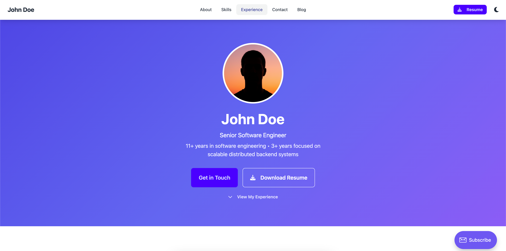

# Personality Ghost Theme

A modern, responsive Ghost theme with static homepage and blog functionality. Features dark/light theme switching, comprehensive content block support, and extensive customization options.

## Features

- **Static Homepage** - Resume/portfolio page at root (`/`)
- **Blog at `/blog/`** - Full blog functionality with categories
- **Dark/Light Theme** - Automatic theme switching with localStorage
- **Responsive Design** - Mobile-first approach with DaisyUI
- **Ghost Content Blocks** - Full support for all Koenig editor blocks
- **Search Integration** - Ghost Sodo Search functionality
- **Customization Options** - Extensive theme settings via Ghost admin

## Screenshots




## Installation

1. Download or clone this theme
2. Copy `data.example.json` to `data.json` and fill it with your personal data
3. Upload to your Ghost installation via Admin → Design → Themes
4. Activate the theme
5. Configure customization options in Admin → Design → Customize

## Using This Repository as a Template

This repository serves as a template for creating your own Ghost theme. Follow these steps to create and deploy your own version:

### 1. Create Your Own Repository from This Template

1. Click the **"Use this template"** button on GitHub
2. Name your new repository
3. Choose visibility (public or private)
4. Click **"Create repository from template"**

### 2. Set Up Ghost Admin API Integration

To enable automated deployments and theme updates, you need to create an integration in your Ghost admin panel:

1. Go to your Ghost admin panel: `https://your-ghost-blog.com/ghost`
2. Navigate to **Settings → Integrations → Add custom integration**
3. Give it a name (e.g., "GitHub Theme Deployment")
4. Copy the **Admin API Key** and **Admin API URL**
5. Keep these credentials safe - you'll need them in the next step

### 3. Add API Credentials to GitHub Secrets

1. Go to your GitHub repository
2. Navigate to **Settings → Secrets and variables → Actions**
3. Click **"New repository secret"** and add:
   - **Name:** `GHOST_ADMIN_API_KEY`
   - **Value:** Paste your Ghost Admin API Key
4. Click **"New repository secret"** again and add:
   - **Name:** `GHOST_ADMIN_API_URL`
   - **Value:** Paste your Ghost Admin API URL (e.g., `https://your-ghost-blog.com`)

These secrets will be used by GitHub Actions to automatically update your theme on your Ghost blog when you push changes.

## Customization Options

### Header Settings

- **Header Style**: Choose between `default`, `centered`, or `minimal`
- **Show Announcement Bar**: Toggle announcement bar visibility
- **Show Search**: Enable/disable search functionality
- **Show Resume Button**: Toggle resume download button

### Blog Settings

- **Show Featured Posts**: Display featured posts section on blog page
- **Posts per Page**: Number of posts displayed (default: 10)

### Post Settings

- **Show Author Bio**: Display author information in posts
- **Show Reading Time**: Display estimated reading time
- **Show Share Buttons**: Enable social sharing buttons
- **Show Related Posts**: Display related posts section

### Colors

- **Primary Color**: Main theme color (default: #4f46e5)
- **Secondary Color**: Secondary theme color (default: #7c3aed)
- **Accent Color**: Accent color for highlights (default: #06b6d4)
- **Text Color**: Main text color (default: #1f2937)
- **Background Color**: Page background color (default: #ffffff)

### Typography

- **Font Family**: Choose from Inter, Roboto, Open Sans, Lato, Poppins
- **Font Size**: Select small, medium, or large text size

### Layout

- **Sidebar Position**: Choose left, right, or no sidebar

### Footer

- **Footer Style**: Select simple, detailed, or minimal footer
- **Show Social Links**: Toggle social media links in footer

## File Structure

```
ghost-theme/
├── assets/
│   ├── css/
│   │   └── screen.css          # Compiled CSS
│   ├── favicon.svg             # Site favicon
│   └── resume-ilia-zhitenev.pdf # Resume file
├── partials/
│   ├── navigation.hbs          # Site navigation
│   ├── footer.hbs              # Site footer
│   └── announcement.hbs        # Announcement bar
├── src/
│   └── screen.css              # Source CSS with Tailwind
├── default.hbs                 # Base template
├── index.hbs                   # Static homepage
├── home.hbs                    # Blog listing page
├── post.hbs                    # Individual post template
├── page.hbs                    # Static page template
├── tag.hbs                     # Tag archive template
├── routes.yaml                 # Custom routing
└── package.json                # Theme configuration
```

## Development

### Prerequisites

- Node.js 16+
- npm or yarn

### Setup

1. Install dependencies:
   ```bash
   npm install
   ```

2. Start development mode:
   ```bash
   npm run dev
   ```

3. Build for production:
   ```bash
   npm run build
   ```

### CSS Development

The theme uses Tailwind CSS with DaisyUI. Source files are in `src/screen.css` and compiled to `assets/css/screen.css`.

## Customization

### Adding Custom CSS

Add custom styles to `src/screen.css`:

```css
/* Custom styles */
.my-custom-class {
    @apply bg-primary text-white p-4 rounded-lg;
}
```

### Modifying Templates

All templates use Handlebars syntax and support Ghost's built-in helpers. Key templates:

- `default.hbs` - Base layout with head/foot
- `index.hbs` - Static homepage (resume)
- `home.hbs` - Blog listing page
- `post.hbs` - Individual post display

### Adding Custom Fields

To add new customization options:

1. Add to `package.json` under `custom` section
2. Use `{{@custom.field_name}}` in templates
3. Access via Ghost admin interface

## Ghost Features Supported

- ✅ Content API
- ✅ Admin API
- ✅ Koenig Editor (all content blocks)
- ✅ Search functionality
- ✅ Navigation management
- ✅ Tag management
- ✅ Author profiles
- ✅ Featured posts
- ✅ Announcement bar
- ✅ Custom routing
- ✅ Theme customization

## Browser Support

- Chrome 90+
- Firefox 88+
- Safari 14+
- Edge 90+

## License

MIT License - see LICENSE file for details.

## Support

For issues and questions:
- Create an issue on GitHub
- Check Ghost documentation
- Review theme customization guide

## Changelog

[Changelog](./CHANGELOG.md)